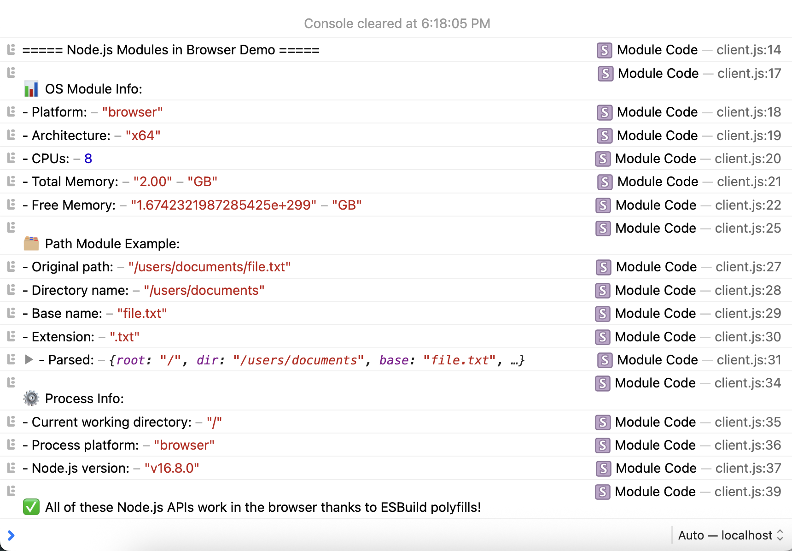

# ESBuild Settings Example

## Overview

This example demonstrates how to customize the bundling process in DOMStack by configuring ESBuild options. Specifically, it shows how to use Node.js built-in modules in browser-side JavaScript by applying polyfills.

## What This Example Shows

- How to create and use an `esbuild.settings.js` file
- How to configure ESBuild plugins (in this case, for Node.js polyfills)
- How browser code can use Node.js modules safely

## How It Works

1. The `client.js` file imports a Node.js built-in module (`os`)
2. The `esbuild.settings.js` file configures the `esbuild-plugin-polyfill-node` plugin
3. During the build process, DOMStack uses these settings to polyfill Node.js modules
4. The result is browser-compatible JavaScript that simulates Node.js APIs

Open your developer tools to see something like this:

## Key Files

- `esbuild.settings.js`: Contains the ESBuild configuration
- `client.js`: Demonstrates importing a Node.js module
